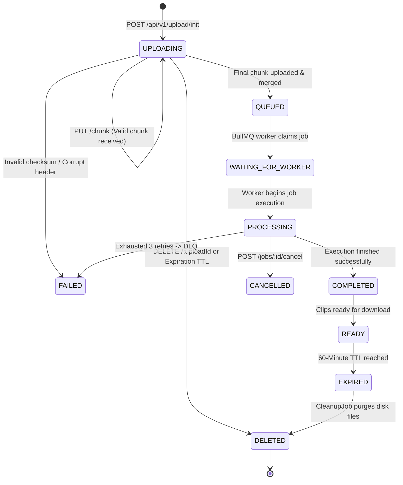

# ClipForge Architecture Overview

This document describes the production engineering architecture, layer boundaries, state machine transitions, event-driven design, storage provider abstractions, resumable upload subsystem, and asynchronous background processing system in ClipForge.

---

## 1. System Architecture & Layer Boundaries

```mermaid
graph TD
    Client[React + Vite Frontend] -->|HTTPS API Requests /api/v1| Fastify[Fastify Node.js Backend API /api/v1]
    SharedPackage[@clipforge/shared Monorepo Package] -->|Import DTOs, Enums, Types| Client
    SharedPackage -->|Import DTOs, Enums, Types| Fastify

    Fastify -->|Request Validation & Health| HealthEndpoint[GET /health]
    Fastify -->|Resumable Chunked Upload| ResumableService[ResumableUploadService /api/v1/upload]
    ResumableService -->|Dispatch Chunks & Merged Streams| StorageProvider[IStorageProvider Abstraction]
    StorageProvider --> LocalStorage[LocalStorageProvider ./storage/temp, ./storage/uploads, ./storage/logs]

    Fastify -->|Enqueue Job with Priority| QueueService[QueueService / BullMQ]
    QueueService -->|video-processing-queue| MainQueue[BullMQ Redis Queue]
    QueueService -->|video-processing-dlq| DLQ[Dead Letter Queue]
    QueueService -->|cleanup-queue| CleanupQueue[BullMQ Cleanup Queue]

    subgraph Asynchronous Worker Infrastructure
        WorkerService[WorkerService / BullMQ Worker] -->|Listen & Pick Up Jobs| MainQueue
        WorkerService -->|Update Status: WAITING_FOR_WORKER -> PROCESSING| VideoService[VideoService / DB]
        WorkerService -->|Instantiate & Execute| VideoJob[VideoProcessingJob]
        VideoJob -->|Report Progress 20%..100%| VideoService
        WorkerService -->|On 3 Failed Attempts| DLQ
    end

    Fastify -->|POST /api/v1/jobs/:id/cancel| QueueService
    Fastify -->|GET /api/v1/queue/stats| WorkerService
```

---

## 2. Job Lifecycle State Machine



---

## 3. Background Processing System Architecture

- **`WorkerService` (`backend/src/services/worker.service.ts`)**: Manages BullMQ workers (`Worker<VideoProcessingJobData>`), handles concurrency (`WORKER_CONCURRENCY=2`), execution timeouts (`WORKER_JOB_TIMEOUT_MS=300000`), Dead Letter Queue (DLQ) routing after 3 retries, cancellation token management, and graceful `SIGTERM`/`SIGINT` shutdown.
- **`QueueService` (`backend/src/services/queue.service.ts`)**: Handles enqueueing into BullMQ with job priority support (`1=VIP`, `2=Normal`, `3=Low`), 1-hour cleanup scheduling, and job cancellation.
- **`VideoProcessingJob` (`backend/src/jobs/video-processing.job.ts`)**: Modular job orchestrator simulating 5 step progress updates (20%, 40%, 60%, 80%, 100%) with cancellation token checks. Prepared to be replaced by `FFmpegService` lossless video splitting.
- **Queue Endpoints**:
  - `POST /api/v1/jobs/:id/cancel`: Registers cancellation token and removes queued/in-flight jobs.
  - `GET /api/v1/queue/stats`: Returns real-time metrics (`activeWorkerCount`, `waitingJobsCount`, `activeJobsCount`, `completedJobsCount`, `failedJobsCount`, `delayedJobsCount`, `dlqJobsCount`).
